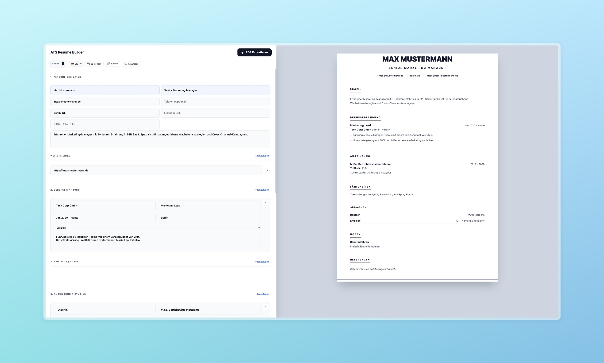

# 📄 ATS Resume Builder

A minimalist, browser-based resume builder designed with one goal: **maximum ATS compatibility** without the fluff.

Create a clean, machine-readable resume in minutes—processed locally in your browser with no backend, no tracking, and no accounts.



---

### ✨ Features

* 🎯 **ATS-First Layout**
    Single-column, semantic HTML structure optimized for reliable parsing by systems like **Workday, Greenhouse, or SAP**.
* 🔍 **Keyword Matching**
    Compare your resume directly against job descriptions to identify missing keywords instantly.
* 🦙 **Advanced Ollama AI Coach (Local)**
    Use local Ollama models for fit analysis, summary rewrite, bullet optimization, skill-gap planning, keyword clustering, interview prep, and full AI report generation.
    Includes live streaming mode, role-based AI presets (AI Architect / Full Stack / DevOps), and optional auto-apply for Summary, Bullets, and Skills.
* 🌍 **Multilingual (EN/DE)**
    UI and placeholders are fully available in both English and German.
* 💾 **JSON Import / Export**
    Save and load your progress locally via `.json` files. Your data stays yours.
* 🎨 **Live Preview**
    See changes in real-time, including subtle color and layout adjustments.
* 🖨️ **Clean PDF Export**
    Optimized for A4 via `@media print`—no external rendering engines or APIs required.

---

### 🚀 Quick Start

```bash
git clone https://github.com/amariwan/atsresume.git
cd atsresume
```

**Then simply:**
1. Open `index.html` in any modern browser.
2. Enter your details.
3. Print to PDF (`Cmd/Ctrl + P`).

**No build steps. No setup. No dependencies.**

---

### 🛠️ Tech Stack

| Category | Technology |
| :--- | :--- |
| **UI** | HTML5 + CSS3 |
| **Logic** | Vanilla JS (ES6) |
| **State Handling** | In-Memory + JSON Export |
| **Print Engine** | CSS `@media print` |
| **File Handling** | FileReader API + Blob API |

---

### 💡 Why this tool?

Most resume builders (like Canva) prioritize aesthetics over algorithms. While they look great to humans, they are often unreadable to machines.

**The Problem:**
* Multi-column layouts confuse parsers.
* Tables, graphics, and icons hide text.
* Non-semantic HTML leads to "broken" data.

**The Solution:**
* **Linear Structure:** Guaranteed reading order.
* **Semantic HTML:** Proper use of `<section>`, `<h1>`, and `<ul>` tags.
* **Content Focus:** Prioritizing readability over layout gimmicks.

---

### 🧠 Design Principles

* **ATS > Aesthetics:** Functionality for the job hunt first.
* **Zero Backend:** Maximum speed and security.
* **Privacy First:** No data ever leaves your machine.
* **Instant Feedback:** What you see is what the system gets.

---

### 📦 Roadmap

* [ ] Custom Section Support
* [ ] Markdown Import
* [ ] LinkedIn Profile Parser
* [ ] Multiple ATS-safe Templates

---

### 🤝 Contributing

Pull requests are welcome! We focus on:
1. Performance optimizations.
2. Improving ATS parsing accuracy.
3. Maintaining "Vanilla" simplicity.